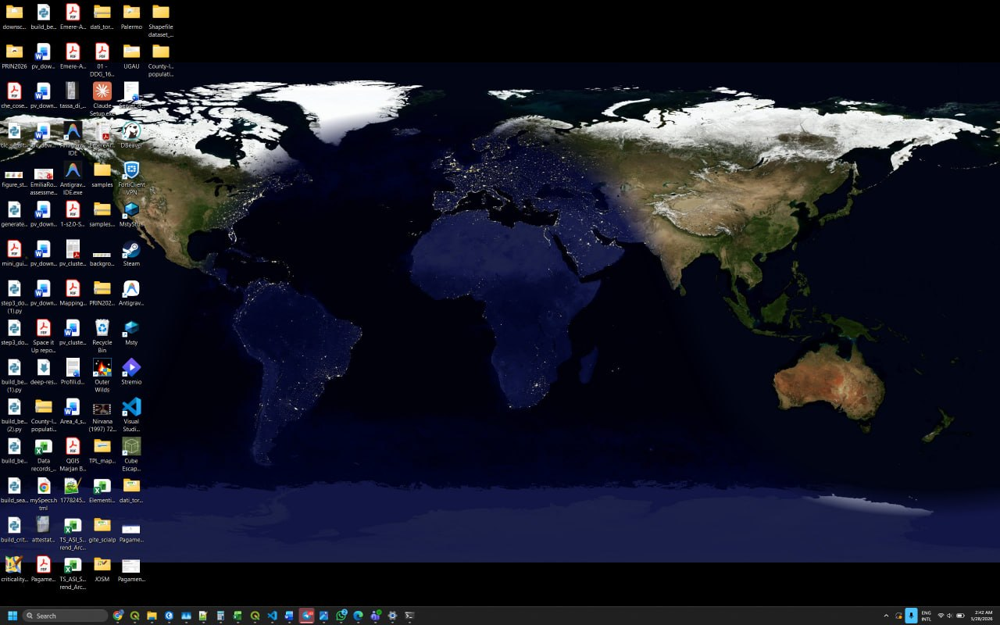
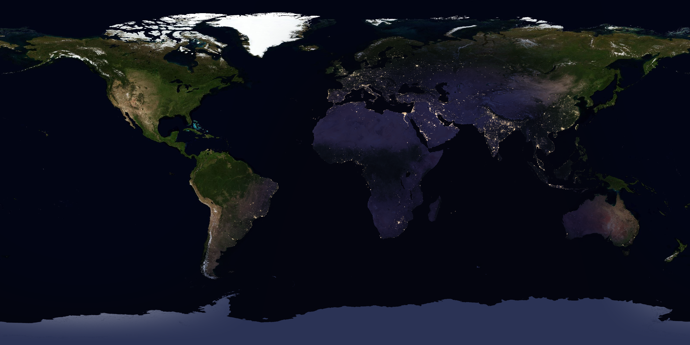

# BlueMarble

Live NASA Blue Marble wallpaper for Windows — your desktop always shows Earth as it looks **right now**, with the real-time day/night terminator, city lights on the dark side, and ocean glint on the sunlit side.



## What it does

- Downloads daytime (Blue Marble Next Generation) and nighttime (Black Marble / VIIRS city lights) imagery from NASA GIBS.
- Computes the **subsolar point** from the current UTC time and blends day & night through a soft terminator.
- Re-renders and applies the wallpaper **every 5 minutes** (configurable), so the terminator tracks real solar position.
- On multi-monitor setups, generates a **separate image per display at its native pixel resolution** and applies it via `IDesktopWallpaper` — no upscaling blur, no distortion, no matter how different the resolutions or DPI scales are.
- Lives in the **system tray** (no taskbar window). Right-click for pause / force refresh / exit.



## Requirements

- Windows 10 1809 (build 17763) or newer, x64 or ARM64.
- Internet access on first launch (and after each midnight UTC) to fetch fresh imagery from NASA GIBS. Imagery is cached locally under `%LOCALAPPDATA%\BlueMarble\cache`.

The published binary is **self-contained**: no .NET runtime install needed.

## Installation

### Option A — Pre-built binary

1. Grab the latest `BlueMarble.exe` from the [Releases](https://github.com/EmereArco/BlueMarble/releases) page (when available) or from the publish output of a local build (see Option B).
2. Place it anywhere you like, e.g. `%LOCALAPPDATA%\Programs\BlueMarble\BlueMarble.exe`.
3. Double-click to run. A globe icon appears in the system tray.
4. (Optional) To auto-start at login, add the path to `HKCU\Software\Microsoft\Windows\CurrentVersion\Run`:
   ```powershell
   New-ItemProperty -Path 'HKCU:\Software\Microsoft\Windows\CurrentVersion\Run' `
     -Name BlueMarble `
     -Value "$env:LOCALAPPDATA\Programs\BlueMarble\BlueMarble.exe" `
     -PropertyType String -Force
   ```

### Option B — Build from source

Prerequisites:
- **Visual Studio Build Tools 2022** (the standalone .NET SDK is **not** enough — see the note below).
- The Windows App SDK workload is pulled in automatically via NuGet.

```powershell
git clone https://github.com/EmereArco/BlueMarble.git
cd BlueMarble

# Run tests (pure .NET, dotnet CLI works fine for these)
dotnet test BlueMarble.Tests/BlueMarble.Tests.csproj -c Debug

# Publish a self-contained, single-file release (x64)
& "C:\Program Files (x86)\Microsoft Visual Studio\2022\BuildTools\MSBuild\Current\Bin\MSBuild.exe" `
  BlueMarble\BlueMarble.csproj `
  -t:Publish `
  -p:Configuration=Release `
  -p:Platform=x64 `
  -p:RuntimeIdentifier=win-x64 `
  -p:EnableMsixTooling=true
```

Output: `BlueMarble\bin\x64\Release\net8.0-windows10.0.19041.0\win-x64\publish\BlueMarble.exe`.

For ARM64, replace `x64` / `win-x64` with `ARM64` / `win-arm64`.

> **Why MSBuild and not `dotnet build`?** WindowsAppSDK 1.6's `MrtCore.PriGen.targets` resolves `Microsoft.Build.Packaging.Pri.Tasks.dll` relative to the running MSBuild root. VS Build Tools' MSBuild finds it under `…\BuildTools\MSBuild\…\AppxPackage\`; the standalone .NET SDK doesn't ship an equivalent. This is an environment constraint, not a project bug.

## Configuration

Settings live in `%LOCALAPPDATA%\BlueMarble\settings.json` (created on first run with defaults). Edit and restart the app to apply.

| Key | Default | Meaning |
|---|---|---|
| `refreshInterval` | `00:05:00` | How often the wallpaper is re-composed (min 1 minute). |
| `outputWidth` / `outputHeight` | `3840` / `2160` | Fallback master frame size when no monitor is enumerated; on multi-monitor setups the size is derived from the largest display (capped at 8192 px). |
| `terminatorSoftnessDegrees` | `22.0` | Half-width of the dawn/dusk blend band. |
| `oceanGlintStrength` | `0.6` | Intensity of the subsolar specular highlight (0 to disable). |
| `oceanGlintRadiusDegrees` | `35.0` | Angular spread of the glint. |
| `wallpaperPosition` | `Fit` (3) | Used only on the single-image fallback path; per-monitor frames are always sized exactly to their display. |
| `launchAtLogin`, `pauseOnBattery`, `pauseOnFullscreenApp` | reserved | Wired into settings, UI in progress. |

The tray menu provides **Pause**, **Refresh now**, and **Exit**.

## How it works

```
NASA GIBS WMS                       Tile cache                Composer                   Per-monitor framer
(blue-marble-ng,                    (%LOCALAPPDATA%           (Skia, soft                (letterbox to each
 black-marble VIIRS)  ──fetch──▶    \BlueMarble\cache)  ──▶   terminator + glint)  ──▶   monitor's native size)
                                                                                                  │
                                                                                                  ▼
                                                                                       IDesktopWallpaper::SetWallpaper
                                                                                       (one image per monitor ID)
```

The solar geometry uses the standard equation of time + declination approximations for the subsolar point; the terminator is the locus where cos(solar zenith angle) crosses zero, soft-stepped across `terminatorSoftnessDegrees`. See `BlueMarble/Composition/SolarGeometry.cs` and `FrameComposer.cs`.

## Project layout

```
BlueMarble/
├── Imagery/        GIBS WMS client, tile cache, day/night providers
├── Composition/    SolarGeometry, FrameComposer, MonitorFrame   (pure — tested)
├── Wallpaper/      WallpaperApplier, MonitorEnumerator          (Position pure)
├── UI/             TrayIconHost, PrefetchRefreshController, RefreshScheduler
├── Native/         P/Invoke, IDesktopWallpaper COM interop
└── Settings/       AppSettings + JSON store
BlueMarble.Tests/   xUnit, links pure files from the main project
```

## Credits

- **Imagery**: NASA Earth Observatory Blue Marble Next Generation (2004) and VIIRS Black Marble (2016), served via [NASA GIBS](https://nasa-gibs.github.io/gibs-api-docs/).
- Composition is done with [SkiaSharp](https://github.com/mono/SkiaSharp); the tray icon uses [H.NotifyIcon.WinUI](https://github.com/HavenDV/H.NotifyIcon).

## License

To be decided. Until a license file is added, all rights reserved.
